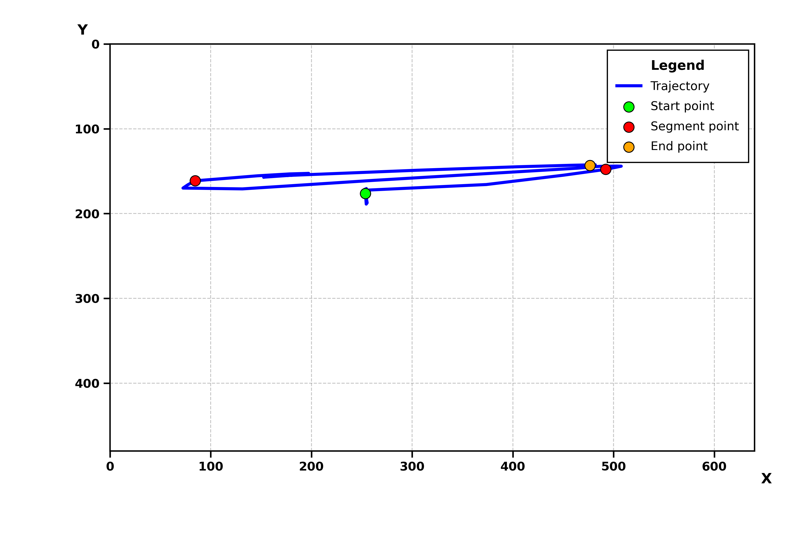

<div align="center">

# Real-Time Cloth Bend Trajectory Segmentation using YOLOv8 Oriented Bounding Boxes (OBB)

### Automatic Bend-Point Detection, Trajectory Analysis, and Temporal Motion Segmentation


*A real-time computer vision framework for cloth trajectory tracking and automatic temporal segmentation using a custom-trained YOLOv8 Oriented Bounding Box model.*

</div>

---

# Overview

This repository presents a **real-time trajectory analysis framework** built upon a custom-trained **YOLOv8 Oriented Bounding Box (OBB)** detector for cloth tracking.

Unlike conventional object tracking systems that only estimate object positions, this framework analyzes the **complete motion trajectory**, automatically identifies **bend points**, and divides long trajectories into meaningful **temporal motion segments**.

The framework combines modern deep learning-based object detection with classical signal processing techniques to generate robust trajectory representations suitable for robotics, cloth manipulation, industrial automation, and activity analysis.

---

# Key Features

✅ Real-time YOLOv8 OBB object detection

✅ Geometric center extraction from rotated bounding boxes

✅ Real-time trajectory tracking

✅ Exponential Moving Average (EMA) smoothing

✅ Savitzky–Golay trajectory smoothing

✅ Automatic motion start detection

✅ Bend-angle based temporal segmentation

✅ Live trajectory visualization

✅ Automatic boundary point detection

✅ CSV export

✅ JSON export

✅ High-resolution trajectory graph generation

✅ Annotated video recording

✅ Raw video recording

---

# Demo

The image below illustrates the trajectory generated by the system.

<p align="center">

</p>

### Legend

🟢 **Green Point**
- Motion Start

🔴 **Red Points**
- Automatically detected trajectory segmentation points

🟠 **Orange Point**
- Final object position

🔵 **Blue Curve**
- Smoothed object trajectory

---

# Repository Structure

```text
cloth-bend-segmentation
│
├── README.md
├── requirements.txt
├── .gitignore
│
├── model
│   └── best.pt
│
├── src
│   └── Wipe_mop_new_model.py
│
└── sample_results
    ├── boundary_points.csv
    ├── framewise_data.csv
    ├── segmentation_output.json
    ├── temporal_segments.csv
    ├── trajectory_summary.csv
    ├── trajectory_027_annotated_video.mp4
    ├── trajectory_027_raw_video.mp4
    ├── trajectory_027_trajectory_graph.png
    └── trajectory_027_trajectory_graph_preview.png
```

---

# ⚙ Requirements

- Python 3.10+
- Ultralytics YOLOv8
- OpenCV
- NumPy
- SciPy
- Matplotlib

---

# Installation

Clone the repository

```bash
git clone https://github.com/arshraj1020/cloth-bend-segmentation.git

cd cloth-bend-segmentation
```

Install the required dependencies

```bash
pip install ultralytics opencv-python numpy scipy matplotlib
```

or

```bash
pip install -r requirements.txt
```

---

# Model

This project uses a **custom-trained YOLOv8 Oriented Bounding Box (OBB)** model.

The repository includes the trained inference model:

```
model/
    best.pt
```

> **Note**
>
> The dataset used to train this model is proprietary and therefore **is not included** in this repository.

---

# Running the Project

Simply execute

```bash
python src/Wipe_mop_new_model.py
```

The program automatically

- Opens the webcam
- Detects the target object
- Tracks the object center
- Smooths the trajectory
- Detects motion start
- Detects bend points
- Generates temporal segments
- Saves all outputs automatically

---

# Keyboard Controls

| Key | Action |
|------|--------|
| **S** | Save current trajectory and begin a new trajectory |
| **R** | Reset current trajectory without saving |
| **Q** | Save trajectory and terminate the application |

---

# Configuration

Almost every parameter of the framework can be modified directly from the **USER SETTINGS** section inside the source code.

Important configurable parameters include:

| Parameter | Description |
|------------|-------------|
| `MODEL_PATH` | Path to YOLOv8 model weights |
| `TARGET_CLASS` | Object class to detect |
| `CAMERA_INDEX` | Webcam index |
| `CONF_THRESHOLD` | Detection confidence threshold |
| `YOLO_IMGSZ` | YOLO inference image size |
| `EMA_ALPHA` | EMA smoothing factor |
| `SAVGOL_WINDOW` | Savitzky–Golay window size |
| `MIN_BEND_ANGLE_DEG` | Minimum bend angle for segmentation |
| `MIN_SEGMENT_LENGTH_FRAMES` | Minimum trajectory segment length |
| `MAX_BOUNDARIES` | Maximum number of segmentation points |

---

# What Happens Internally?

The system continuously processes live webcam frames and performs:

1. Object Detection
2. Object Tracking
3. Trajectory Smoothing
4. Motion Analysis
5. Bend Detection
6. Automatic Temporal Segmentation
7. Data Export
8. Visualization

The result is a complete trajectory analysis pipeline capable of generating structured motion information from live object movement.

---

# ## Processing Pipeline

The complete workflow of the proposed framework is illustrated below. It combines **deep learning** with **classical signal processing** to achieve robust, real-time trajectory segmentation.

```mermaid
flowchart TD
    A[📷 Webcam Stream] --> B[YOLOv8 OBB<br/>Object Detection]
    B --> C[Geometric Center<br/>Point Extraction]
    C --> D[Object Association<br/>&amp; Tracking]
    D --> E[Exponential Moving<br/>Average (EMA)]
    E --> F[Savitzky–Golay<br/>Trajectory Smoothing]
    F --> G[Automatic Motion<br/>Start Detection]
    G --> H[Bend Angle<br/>Computation]
    H --> I[Automatic Temporal<br/>Segmentation]
    I --> J[CSV • JSON • Graph<br/>• Video Export]

    classDef dl fill:#CECBF6,stroke:#534AB7,stroke-width:1px,color:#26215C;
    classDef dsp fill:#9FE1CB,stroke:#0F6E56,stroke-width:1px,color:#04342C;
    classDef io fill:#F5C4B3,stroke:#993C1D,stroke-width:1px,color:#4A1B0C;

    class B,C,D dl
    class E,F,G,H,I dsp
    class A,J io
```

<div align="center">

| Stage | Component |
|---|---|
| 🟣 **Deep Learning** | YOLOv8 OBB Detection · Center Extraction · Tracking |
| 🟢 **Signal Processing** | EMA · Savitzky–Golay · Motion Detection · Bend Angle · Segmentation |
| 🟠 **I/O** | Webcam Input · CSV/JSON/Graph/Video Output |

</div>
---

# Sample Result

The figure below demonstrates a trajectory captured by the proposed system.

<p align="center">

</p>

The generated trajectory contains

- Motion Start Point
- Automatically detected segmentation points
- Final object location
- Smoothed trajectory curve

---

# Example Temporal Segmentation

Using the provided sample trajectory, the framework automatically divided the motion into multiple temporal segments.

| Segment | Start Frame | End Frame | Duration |
|----------|------------:|----------:|---------:|
| Segment 1 | 1 | 16 | 16 Frames |
| Segment 2 | 17 | 27 | 11 Frames |
| Segment 3 | 28 | 40 | 13 Frames |

These segmentation points are detected automatically using bend-angle analysis without manual annotation.

---

# Output Files

Each saved trajectory generates the following outputs.

## CSV Files

### framewise_data.csv

Stores information for every processed frame.

Contains

- Frame Number
- Raw Coordinates
- Smoothed Coordinates
- Detection Confidence
- Bounding Box
- Segment ID
- Tracking Status

---

### boundary_points.csv

Contains every detected segmentation point.

Information includes

- Boundary ID
- Frame Number
- Coordinates
- Bend Angle
- Boundary Score

---

### temporal_segments.csv

Stores all generated temporal segments.

Contains

- Segment ID
- Start Frame
- End Frame
- Segment Duration

---

### trajectory_summary.csv

Provides a compact summary of the trajectory.

Includes

- Total Frames
- Number of Segments
- Boundary Frames
- Output Paths

---

## JSON Output

The framework also exports

```
segmentation_output.json
```

which stores

- Motion Start
- Boundary Points
- Temporal Segments
- Output File Paths

This file can be directly consumed by external applications or robotic systems.

---

## Graph Output

A high-resolution trajectory visualization is automatically generated.

It illustrates

- Start Point
- End Point
- Trajectory
- Segment Points

making it suitable for publications and presentations.

---

## Video Output

Two videos are generated.

### Annotated Video

Contains

- Detection
- Bounding Boxes
- Live Trajectory
- Segment Points
- Tracking Information

### Raw Video

Stores the original camera feed without annotations.

---

# Algorithm Overview

The proposed method consists of four major stages.

### 1. Object Detection

A custom-trained YOLOv8 Oriented Bounding Box model detects the target object.

---

### 2. Trajectory Tracking

The geometric center of each detected rotated bounding box is extracted and tracked across consecutive frames.

---

### 3. Trajectory Smoothing

Noise is reduced using

- Exponential Moving Average (EMA)

followed by

- Savitzky–Golay filtering

to generate a smooth trajectory suitable for analysis.

---

### 4. Temporal Segmentation

Incoming and outgoing motion vectors are computed.

Whenever the bend angle exceeds the predefined threshold, a segmentation point is created.

These segmentation points divide the trajectory into meaningful motion primitives.

---

# Applications

The proposed framework can be applied to

- Cloth Manipulation
- Robot Learning
- Motion Primitive Extraction
- Human Activity Analysis
- Industrial Automation
- Object Tracking
- Trajectory Analysis
- Pick-and-Place Robotics
- Smart Manufacturing
- Vision-based Robotics

---

# Future Improvements

Potential future extensions include

- Multi-object tracking

- DeepSORT / ByteTrack integration

- ROS2 integration

- Multi-camera trajectory fusion

- 3D trajectory estimation

- Transformer-based trajectory understanding

- Online action recognition

- Real-time robotic control

- Automatic trajectory classification

---

# Limitations

Current limitations include

- Single object tracking

- Requires a trained YOLOv8 OBB model

- Webcam-based implementation

- 2D trajectory analysis only

---

# Citation

If you use this repository in your research, please cite it as

```bibtex
@software{cloth_bend_segmentation,
  author = {Arsh Raj},
  title = {Real-Time Cloth Bend Trajectory Segmentation using YOLOv8 OBB},
  year = {2026},
  url = {https://github.com/arshraj1020/cloth-bend-segmentation}
}
```

---

# Acknowledgements

This project was developed using

- Ultralytics YOLOv8
- OpenCV
- NumPy
- SciPy
- Matplotlib

Special thanks to the open-source computer vision community.

---

# 📜 License

This project is released under the **MIT License**.

You are free to use, modify, and distribute this software under the terms of the license.

---

# Support

If you found this repository useful,

Star the repository

🍴 Fork it

📢 Share it with the computer vision community

---

<div align="center">

### Developed by **Arsh Raj**

Computer Vision • Deep Learning • Robotics • AI

</div>
